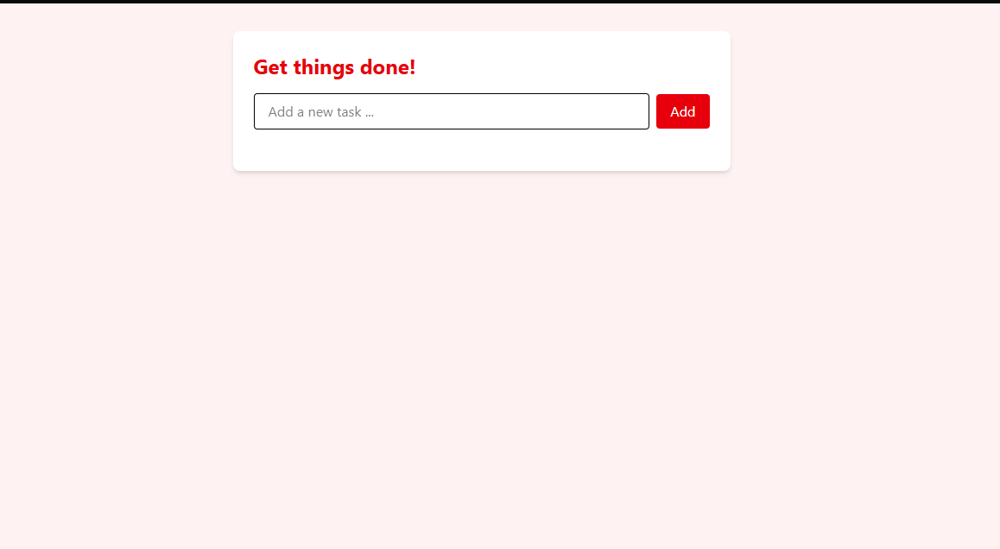
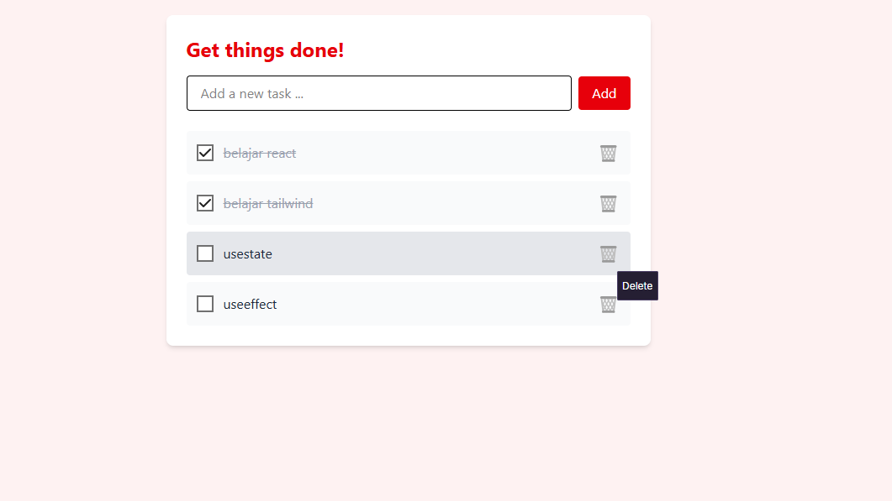

# Simple Todo List

A clean and minimal task management application built with **React**, **Vite**, and **React Context API**. Easily add and delete tasks while experiencing efficient state management without prop drilling.

---

## 🔍 Preview

| Empty State | With Tasks |
|-------------|------------|
|  |  |

---

## 🚀 Getting Started

### 🔧 Manual Installation (Recommended for Beginners)

#### 1. Prerequisites

Make sure you have the following installed:

- [Node.js](https://nodejs.org/) (v16 or above)
- [Git](https://git-scm.com/)
- A code editor or terminal (e.g., VS Code)

#### 2. Clone the repository

```bash
git clone https://github.com/ranandasatria/fgo24-react-todo.git
cd fgo24-react-todo
```

#### 3. Install dependencies

```bash
npm install
```

> 💡 Tip: Use `npm ci` instead of `npm install` for a cleaner, faster install based on `package-lock.json`.

#### 4. Start the development server

```bash
npm run dev
```

Visit the app in your browser at:

```
http://localhost:8080
```

#### 5. (Optional) Build and Preview Production Version

```bash
npm run build
npm run preview
```

---

### 🐳 Docker Setup

#### 1. Clone the project

```bash
git clone https://github.com/ranandasatria/fgo24-react-todo
cd fgo24-react-todo
```

#### 2. Build the Docker image

```bash
docker build . -t react-todo
```

#### 3. Run the container

```bash
docker run -d -p 8080:80 react-todo
```

#### 4. Open the app

Visit:

```
http://localhost:8080
```

> 🛑 To stop the container:
> ```bash
> docker ps
> docker stop <container_id>
> ```

---

## 📦 Dependencies

This project uses:

- [React](https://reactjs.org/) — For building the user interface
- [Vite](https://vitejs.dev/) — For fast development/build tooling
- [React Context API](https://reactjs.org/docs/context.html) — For state management
- [Node.js](https://nodejs.org/) — JavaScript runtime

---

## 🤝 Contributing

Contributions are welcome and appreciated!

1. Fork the repository  
2. Create a new branch (`git checkout -b feature-name`)  
3. Make your changes  
4. Commit and push your code  
5. Open a Pull Request (PR)

Your PR will be reviewed and merged if accepted.

---

## 📄 License

This project is licensed under the **MIT License**.  

---

## ©️ Copyright

&copy; 2025 Kodacademy
